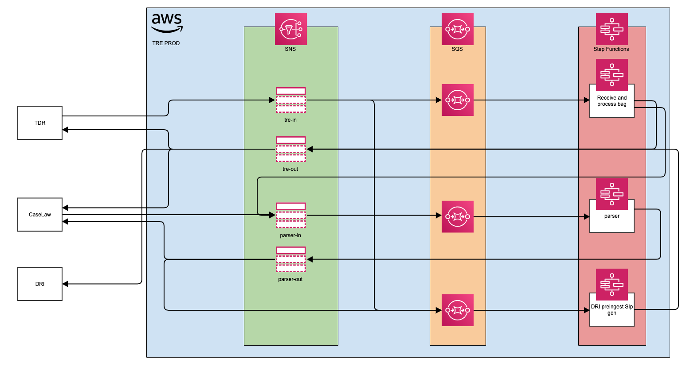

# New messaging architecture

Date: 21-07-2022

## Status

Proposed

## Context

The new [Enhanced message structure](./001-Enhanced-message-structure.md) requires a new architecture on messaging exchange.

## Options considered

See document [New messaging architecture](../technology-considerations/messaging-architecture/README.md) in the technology considerations folder.

## Decision

The decision is to adopt option-3, which is shown below:

## Consequences

What becomes easier or more difficult to do because of this change?