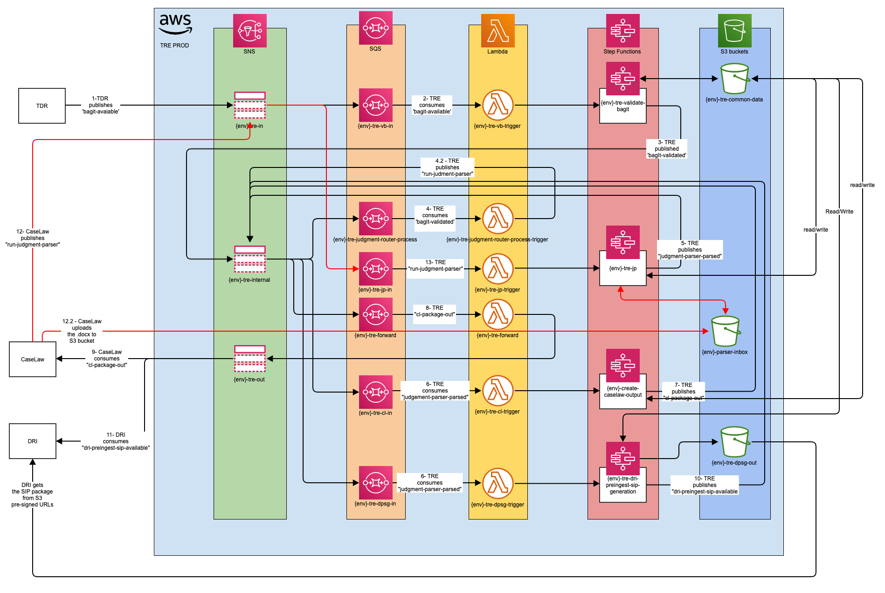

# Proposed messaging architecture

Date: 01-08-2022

## Status

Accepted ___22-03-2023 This is now deprecated see this [repository](https://github.com/nationalarchives/da-transform-schemas/tree/main/tre_schemas) for the latest message schemas and structure___.

## Context

As part of the TRE enhancements we wish to work towards a more decoupled messaging system.

The decoupling will allow for
- a more autonomous behaviour within the system for TRE and others to take advantage of.
- consumers can listen to any message and act on them if required.
- no configuration be required for a third party to add a consumer

To aid with this system enhancement a new [Enhanced message structure](./001-Enhanced-message-structure.md) will be required between TRE and other systems.

The new architecture has to follow the Event-driven approach, with
- event producers,
- event consumers.

## Options considered

See document [New messaging architecture](../technology-considerations/messaging-architecture/README.md) in the [technology considerations](../technology-considerations/) folder.

After review of the options it was felt that Event Bridge did offer some very powerful features however it also had features that would be detremental to the wider goal. These were
- Rules must always be applied to enact a consumer
- A limit of 5 rules per topic

This meant we would not be able to run an autonomous system and have to configure each consumer that wanted to listen to a topic.

## Decision

The following is now proposed as the new messaging architecture:

TRE will have two SNS topics:

- **tre-in** where external systems/services can subscribe and become producers in order to send messages to TRE
- **tre-out** where external systems/services can subsribe and become consumers in order to consume messages from TRE

The topics will not define any SNS rules to filter the messages: the consumers are responsable of filtering the messages, accepting or rejecting them based on their implementation.

There will be an additional SNS topic called **tre-internal** which is dedicated to internal routing, this topic can filter messages and trigger specific AWS step functions.

For more details about the integrations between TRE and other systems have a look at the following pages:

- [New TDR-TRE integration](./003-New-TDR-TRE-integration.md)
- [New CaseLaw-TRE integration](./004-New-CaseLaw-TRE-integration.md)
- [Parser separation](./005-Parser-separation.md)

## Consequences

With this architecture any integration with TRE is much simpler, any new service can be a producer and/or a consumer by subscribing to the two topics **tre-in** and **tre-out**.

A monitoring tool system can easly consume messages from **tre-out** topic.
