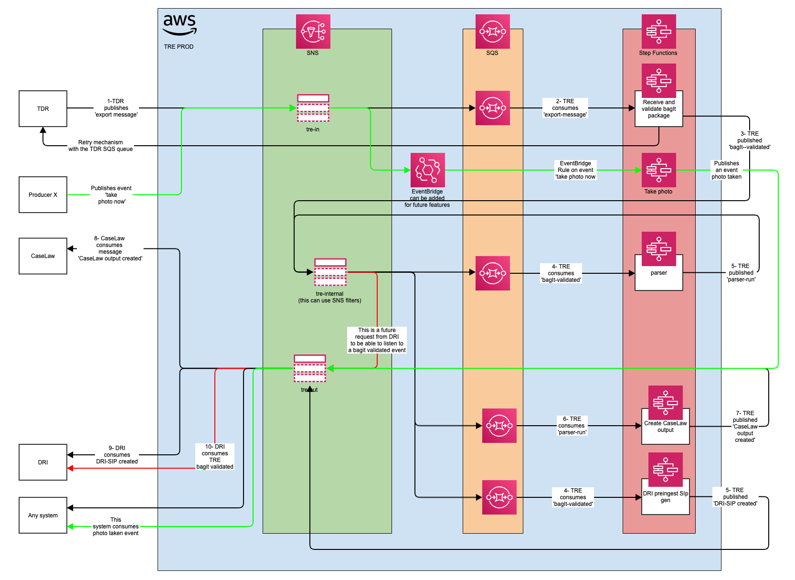

# New messaging architecture

Date: 21-07-2022

## Status

Proposed

## Context

The new [Enhanced message structure](./001-Enhanced-message-structure.md) requires a new architecture on messaging exchange from TRE to other different systems.

## Options considered

See document [New messaging architecture](../technology-considerations/messaging-architecture/README.md) in the [technology considerations](../technology-considerations/) folder.

## Decision

The following is now proposed as the new messaging architecture:

TRE will have two SNS topics:

- tre-in where producers will send messages to TRE
- tre-out where consumers will receive messages from TRE

The diagram includes the Parser separation and two additional topics:

- parser-in where producers will send messages to the Parser Step Function
- parser-out where consumers will receive messages from the Parser Setp Function

## Consequences

What becomes easier or more difficult to do because of this change?