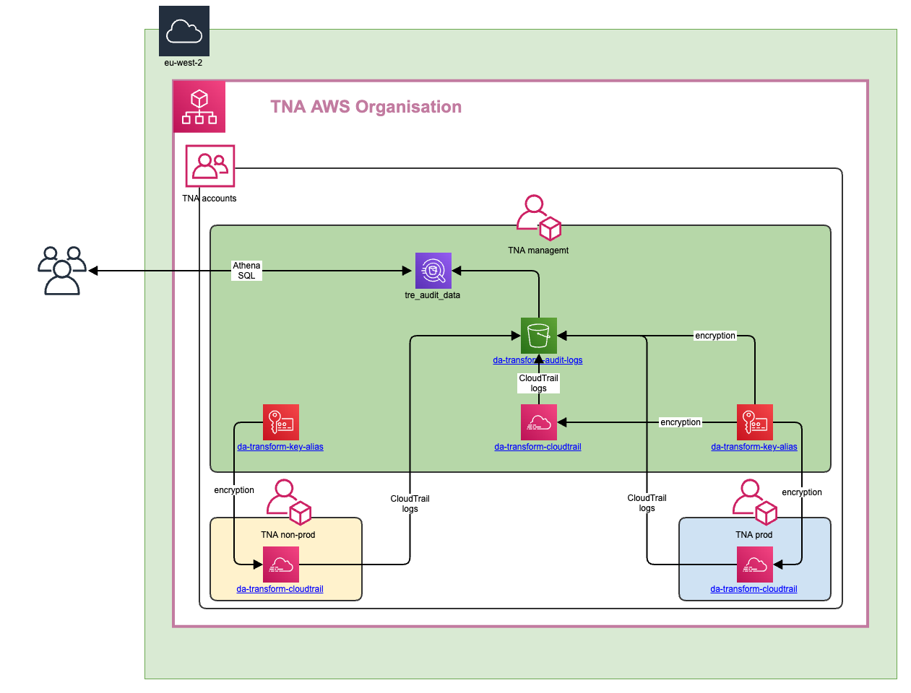

# Audit information for users

Date: 30-08-2022

## Status

Accepted

## Context

As part of the Non Functional Requirements (NFRs), it is mandatory to implement audit logs which includes having data event logging enabled so that S3 access and Lambda invocations are logged.

## Decision

This diagram shows the proposed solution:

- CloudTrail will be enabled in the three AWS accounts: management, non-prod and prod
- The CloudTrail logs will be encrypted using a KMS custom key
- The CloudTrail logs will be sent to a S3 bucket in the AWS management account
- The S3 bucket will use the same KMS custom key used to encrypt the CloudTrail logs
- AWS Athena will be used to query and visualise the data in the S3 bucket
- The audit logs will be retained in the S3 bucket standard storage class for 60 days, after the data will be moved to the Glacier storage class and retained forever.

## Consequences

- It will take time to retrieve audit logs older than 60 days from Glacier.
- It is required to create tables and queries in AWS Athena to visualise the audit logs.
