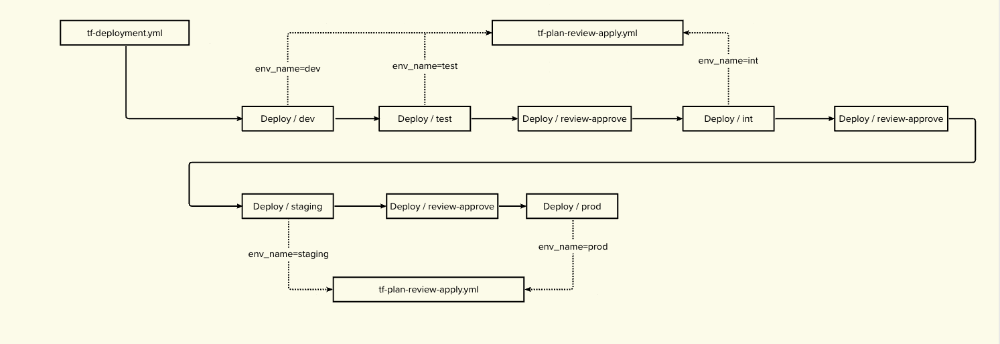

# GitHub actions

Date: 21-11-2022

## Status

In progress

## Context

The CI/CD pipeline to deploy changes to TRE v1 was implemented using AWS CodePipeline and AWS CodeBuild. In order to align with the TNA standards and to be able to support the TRE v2 project internally, it is necessary to implement the CI/CD pipeline using the [GitHub Actions platform](https://docs.github.com/en/actions).

TDR team has already got a mature implementation of CI/CD pipeline using the GitHub Actions platform, with some examples and reusable workflows available [here](https://github.com/nationalarchives/tdr-github-actions). 

TRE team will run a SPIKE to evaluate the GitHub Actions platform using the GitHub repo [tre-blueprint-test-repository](https://github.com/nationalarchives/tre-blueprint-test-repository) and record the decisions in this document.

## Decisions

- Authentication and Security
    - OpenID connection will be used to provide authentication between GitHub Actions platform and TRE AWS management account
    - AWS roles (one AWS role per AWS account) will be used to provision cloud resouces from the TRE AWS management account to the AWS TRE non-prod, prod and users accounts using terraform
    - [AWS permission boundary](https://docs.aws.amazon.com/IAM/latest/UserGuide/access_policies_boundaries.html) will be used to restrict what an identity-based policy can grant to an IAM entity
    - [AWS least privilege pattern](https://aws.amazon.com/blogs/security/techniques-for-writing-least-privilege-iam-policies/) will be used to enforce security for permissions in AWS
- GitHub workflows and artifact repository
    - 
        - The GitHub workflow deployment will be triggered manually from GitHub Actions platform
        - It will call a [reusable workflow](https://docs.github.com/en/actions/using-workflows/reusing-workflows#overview) for running `terraform plan`, `review and approve` and `terraform apply` stages
        - There will be three `review and approve` stages
            - one between `test` and `int` environments
            - one between `int` and `staging` environmetns
            - one between `staging` and `production` environments
    - [AWS ECR](https://docs.aws.amazon.com/AmazonECR/latest/userguide/what-is-ecr.html) will be used to store docker images for lambda functions
    - [AWS CodeArtifact](https://docs.aws.amazon.com/codeartifact/latest/ug/welcome.html) will be used to store common libraries to include when building docker images

## Consequences

N/A