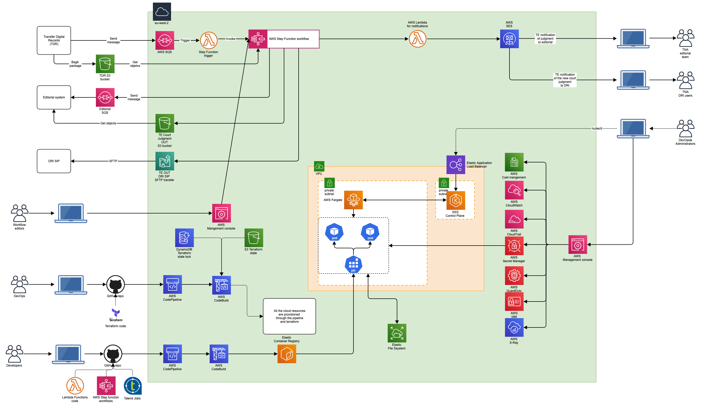

# Beta MVP Transformation pipeline architecture

## Table of Contents
- [Introduction](#introduction)
- [Beta MVP AWS Architecture diagram](#beta-mvp-aws-architecture-diagram)
    - [Roles used in the solution](#roles-used-in-the-solution)
    - [AWS Services used in the solution](#aws-services-used-in-the-solution)
    - [Integration with Transfer Digital Records (TDR)](#integration-with-transfer-digital-records)
    - [Integration with the Judgments parser](#integration-with-the-judgments-parser)
    - [Workflow Studio for AWS Step Functions](#workflow-studio-for-aws-step-functions)
    - [AWS Step Function Workflow for TE](#aws-step-function-workflow-for-te)
- [Quotas for the AWS services](#quotas-for-the-aws-services)
- [AWS accounts management](#aws-accounts-management)

## Introduction

Design an AWS data-transformation infrastructure and pipeline service to securely connect systems. The service will retrieve, transform and send data according to business rules. Initial delivery is an MVP Beta for one data type (Court Judgments in MS Word).

Court judgments are sent to TNA as MS Word documents. The MVP Data Transformation Service must securely retrieve these from a specified cloud location, transform them to XML / LegalDocML using a parser application (created by another TNA project) and route them to our publication service.

The MVP should be designed with a view to future extensibility.

## Beta MVP AWS Architecture diagram

The following architecture diagram simplifies the proposed solution for the Beta MVP Transformation pipeline.

### Roles used in the solution

* Developers
* DevOps
* Administrators
* TNA users
* Workflow editors

### AWS Services used in the solution

* [Amazon Step Functions](https://docs.aws.amazon.com/step-functions/latest/dg/getting-started.html), 
* [Amazon Elastic Kubernetes Service (EKS)](https://aws.amazon.com/eks), gives you the flexibility to start, run, and scale Kubernetes applications in the AWS cloud.
* [AWS Fargate](https://aws.amazon.com/fargate) is a serverless compute engine for containers that works with both [Amazon Elastic Container Service (ECS)](https://aws.amazon.com/ecs/) and [EKS](https://aws.amazon.com/eks/). Fargate makes it easy for you to focus on building your applications. Fargate removes the need to provision and manage servers, lets you specify and pay for resources per application, and improves security through application isolation by design.
* [Amazon Elastic Container Registry (ECR)](https://aws.amazon.com/ecr/) is a fully managed container registry that makes it easy to store, manage, share, and deploy your container images and artifacts anywhere.
* [AWS Identity and access management for Amazon EKS](https://docs.aws.amazon.com/eks/latest/userguide/security-iam.html), IAM administrators control who can be authenticated (signed in) and authorized (have permissions) to use Amazon EKS resources. [OpenID Connect (OIDC) Identity Provider (IDP)](https://aws.amazon.com/blogs/containers/introducing-oidc-identity-provider-authentication-amazon-eks/) feature allows customers to integrate an OIDC identity provider with the Amazon EKS cluster running Kubernetes version 1.16 or later. With this feature, you can manage user access to your cluster by leveraging existing identity management life cycle through your OIDC identity provider. 
    * Additionally, you can enhance this solution with the combination of public OIDC endpoint and IRSA. Administrators and Developers can put the IAM role to a specific pod or restrict to a single IP range of the pod to provide fine grained access.
* [Amazon Simple Email Service (SES)](https://aws.amazon.com/ses/), 
    - We need to define and verufy the email domain.
* [Amazon Simple Queue Service (SQS)](https://aws.amazon.com/sqs/),
* [Amazon Simple Notification Service (SNS)](https://aws.amazon.com/sns/),
* [Amazon Serverless Computing - AWS Lambda](https://aws.amazon.com/lambda/),
* [Amazon CloudWatch](https://docs.aws.amazon.com/step-functions/latest/dg/cw-logs.html),
* [Amazon CloudTrail](https://docs.aws.amazon.com/step-functions/latest/dg/procedure-cloud-trail.html),
* [Amazon GuardDuty](https://aws.amazon.com/guardduty/),
* [Amazon X-Ray](https://docs.aws.amazon.com/step-functions/latest/dg/concepts-xray-tracing.html), You can use [AWS X-Ray](https://docs.aws.amazon.com/xray/latest/devguide/aws-xray.html) to visualize the components of your state machine, identify performance bottlenecks, and troubleshoot requests that resulted in an error. Your state machine sends trace data to X-Ray, and X-Ray processes the data to generate a service map and searchable trace summaries.

### Integration with Transfer Digital Records

The Transfer Digital Records service will have two integration points with the Transformation Service:

1. the service should be able to send a message with metadata to the AWS SQS queue
2. the AWS S3 bucket where TDR stores the Bagit packages should be accessible by the AWS EKS cluster and the pods where the jobs will run

The details for the TDR integration are available [here](./../tdr-integration/README.md)

### Integration with the Judgments parser

This parser converts UK judgments from .docx format to XML. It is written in C# and requires .NET 5.0. The source code in GitHub is available [here](https://github.com/mangiafico/tna-judgments).

To execute the parser we have identified the following options:
1. Execute the paser in a lambda function
2. Wrap the parser in a docker container and use AWS EKS Fargate
3. Call the parser as an external API

The details for the text Parser integration are available [here](./../parser-integration/README.md)

### Workflow Studio for AWS Step Functions

[Workflow Studio for AWS Step Functions](https://docs.aws.amazon.com/step-functions/latest/dg/workflow-studio.html) is a low-code visual workflow designer for Step Functions that lets you create serverless workflows by orchestrating AWS services. Use drag and drop to create and edit workflows, control how input and output is filtered or transformed for each state, and configure error handling. As you create a workflow, Workflow Studio validates your work and auto-generates code. You can review the generated code, or export it for local development or AWS CloudFormation. When you are finished, you can save your workflow, run it, then examine the results in the Step Functions console. You can also use Workflow Studio to prototype new workflows and use your prototypes as the starting point for local development with the AWS Toolkit for Visual Studio Code.

### AWS Step Function Workflow for TE

The following diagram shows the workoflow implemented in AWS Step Function for the Transformation Engine.

## Quotas for the AWS services

* [Amazon Step Functions Quotas](https://docs.aws.amazon.com/step-functions/latest/dg/limits-overview.html)
* [Known limitations when using Workflow Studio](https://docs.aws.amazon.com/step-functions/latest/dg/workflow-studio-known-limitations.html)
* [AWS X-Ray endpoints and quotas](https://docs.aws.amazon.com/general/latest/gr/xray.html)
* [Lambda quotas](https://docs.aws.amazon.com/lambda/latest/dg/gettingstarted-limits.html)
* [Amazon SQS quotas](https://docs.aws.amazon.com/AWSSimpleQueueService/latest/SQSDeveloperGuide/sqs-quotas.html)
* [Amazon Simple Notification Service endpoints and quotas](https://docs.aws.amazon.com/general/latest/gr/sns.html)
* [Service quotas in Amazon SES](https://docs.aws.amazon.com/ses/latest/dg/quotas.html)
* [Quotas for Amazon GuardDuty](https://docs.aws.amazon.com/guardduty/latest/ug/guardduty_limits.html)

## AWS accounts management

To Do
