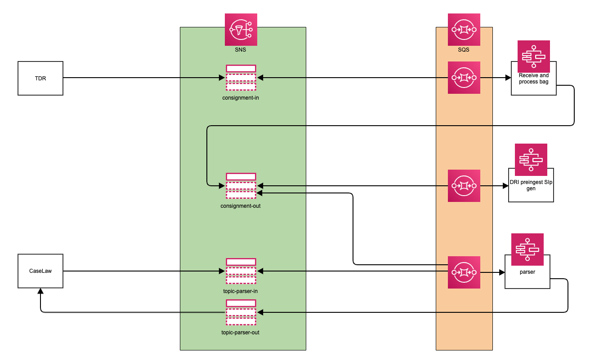
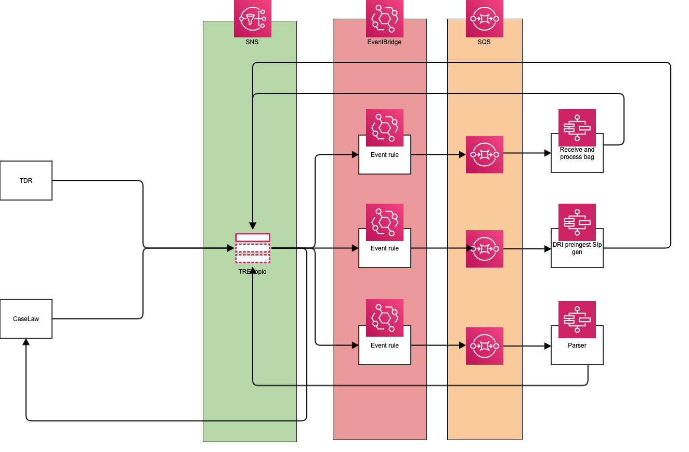

# New messaging architecture

## Option-1 - Multiple SNS topics and SQS queues with fan-out

TO DO

## Option-2 - Single SNS topic and multiple SQS queue with fan-out

TO DO

## Option-3 - Single SNS topic with AWS EventBridge

TO DO

