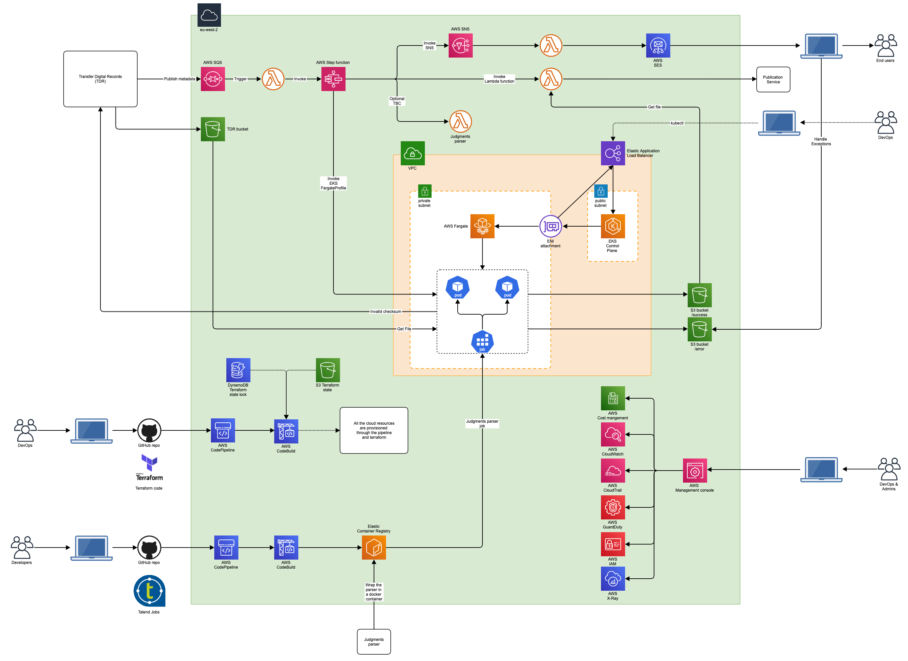
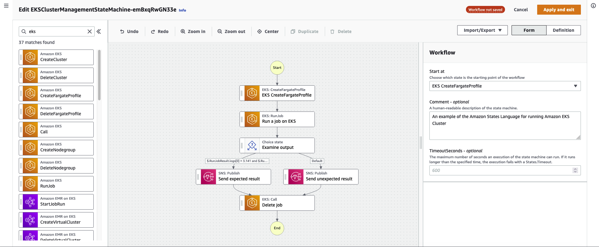

# MVP architecture

TO DO

## Table of Contents
- [Table of Contents](#table-of-contents)
- [Introduction](#introduction)
- [High Level Architecture](#high-level-architecture)
    - [AWS Services used in the solution](#aws-services-used-in-the-solution)
    - [Integration with Transfer Digital Records (TDR)](#integration-with-transfer-digital-records)
    - [Integration with the Judgments parser](#integration-with-the-judgments-parser)
    - [AWS Step Functions](#aws-step-functions)
    - [AWS Fargate](#aws-fargate)
- [AWS Accounts](#aws-accounts)
- [Terraform](#terraform)

### Introduction

TO DO

### High Level Architecture

The following architecture diagram simplifies the proposed solution for the Beta MVP Transformation pipeline.

#### AWS Services used in the solution

* [Amazon Step Functions](https://docs.aws.amazon.com/step-functions/latest/dg/getting-started.html), 
* [Amazon Elastic Kubernetes Service (EKS)](https://aws.amazon.com/eks), gives you the flexibility to start, run, and scale Kubernetes applications in the AWS cloud.
* [AWS Fargate](https://aws.amazon.com/fargate) is a serverless compute engine for containers that works with both [Amazon Elastic Container Service (ECS)](https://aws.amazon.com/ecs/) and [EKS](https://aws.amazon.com/eks/). Fargate makes it easy for you to focus on building your applications. Fargate removes the need to provision and manage servers, lets you specify and pay for resources per application, and improves security through application isolation by design.
* [Amazon Elastic Container Registry (ECR)](https://aws.amazon.com/ecr/) is a fully managed container registry that makes it easy to store, manage, share, and deploy your container images and artifacts anywhere.
* [AWS Identity and access management for Amazon EKS](https://docs.aws.amazon.com/eks/latest/userguide/security-iam.html), IAM administrators control who can be authenticated (signed in) and authorized (have permissions) to use Amazon EKS resources. [OpenID Connect (OIDC) Identity Provider (IDP)](https://aws.amazon.com/blogs/containers/introducing-oidc-identity-provider-authentication-amazon-eks/) feature allows customers to integrate an OIDC identity provider with the Amazon EKS cluster running Kubernetes version 1.16 or later. With this feature, you can manage user access to your cluster by leveraging existing identity management life cycle through your OIDC identity provider. 
    * Additionally, you can enhance this solution with the combination of public OIDC endpoint and IRSA. Administrators and Developers can put the IAM role to a specific pod or restrict to a single IP range of the pod to provide fine grained access.
* [Amazon Simple Email Service (SES)](https://aws.amazon.com/ses/), 
* [Amazon Simple Queue Service (SQS)](https://aws.amazon.com/sqs/),
* [Amazon Simple Notification Service (SNS)](https://aws.amazon.com/sns/)
* [Amazon Serverless Computing - AWS Lambda](https://aws.amazon.com/lambda/)
* [Amazon CloudWatch]()
* [Amazon CloudTrail]()
* [Amazon GuardDuty]()
* [Amazon X-Ray]()

#### Integration with Transfer Digital Records

To Do

Question: What happens when there is an invalid checksum?

#### Integration with the Judgments parser

* Option-1: run the paser in a lambda function
* Option-2: wrap the parser in a docker container and use AWS Fargate

#### AWS Step Functions

##### Quotas

https://docs.aws.amazon.com/step-functions/latest/dg/limits-overview.html

#### AWS Fargate

To Do

### AWS Accounts

TO DO

### Terraform

TO DO