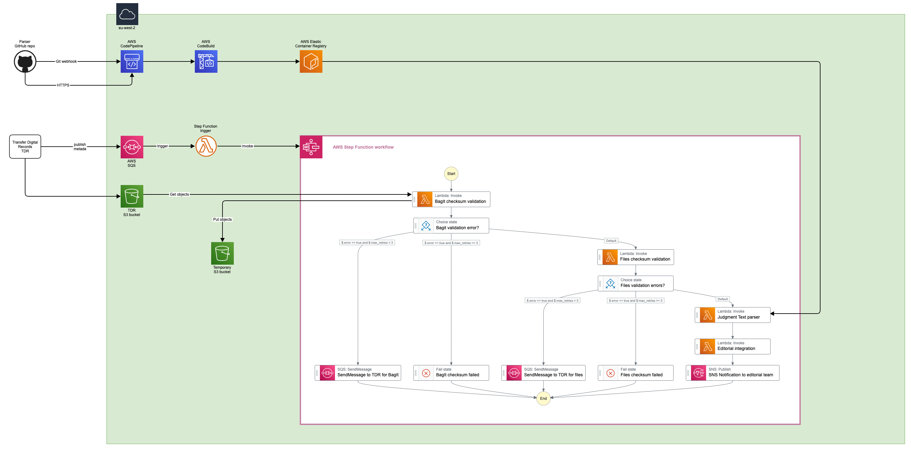

# Parser integration

```diff
- This relates to TRE V1
```

## Table of Contents
- [Introduction](#introduction)
- [Architecture Diagram](#architecture-diagram)
    - [Integration](#integration)
    - [Data flow](#data-flow)
    - [Branch strategy and release cycle](#branch-strategy-and-release-cycle)
- [References](#references)

## Introduction

The text parser is a tool being actively developed by a third party that extracts data properties from the text of court judgment documents. It utilises Microsoft’s Office Open XML SDK (Software Development Kit) and is written with the .NET technology stack.

## Architecture diagram

The following architecture diagram simplifies the proposed solution for Parser integration.



### Integration

The source code of the text parser is stored in a TNA GitHub [repository](https://github.com/nationalarchives/tna-judgments-parser). As shown in the above diagram:

1. Git webhook requests will trigger the AWS CodePipeline and invoke an AWS CodeBuild project.
2. An AWS CodeBuild project connetcs to Git service, then retrieves the latest version of the text parser from the Git repository.
3. AWS CodeBuild builds the text parser from the source code and stores the artefact to AWS ECR.
4. An AWS Lambda Function is defined using the artefact stored in AWS ECR.
5. This Lambda Function will be invoked by the AWS Step Function.

### Data flow

1. TDR will produce a [BagIt package](https://datatracker.ietf.org/doc/html/rfc8493) containing the judgment and technical metadata extracted as part of the existing TDR processes
2. TDR will notify Transformation Engine that the package is ready, and will provide one-time credentials for retrieval
3. When a new message is sent to the SQS, it triggers a Lambda Function which invokes AWS Step Function
4. AWS Step Function will start the workflow:
    1. A Lambda Function is triggered which acquires the package and validates checksum for both, BagIt package and .docx file extracted
    2. If the checksum validation fails, the workflow will retry N-times
    4. If the checksum validation passes, another Lambdda Function will run the text parser against the judgment, which will extract data properties from the text and compile to XML
    5. The outputs of the text parser will be saved to the Parser OUT S3 bucket

### Branch strategy and release cycle

The deployment cycle will follow the GitHub Flow lightweight workflow, and respects the following principles:

1. `master` (or `main`) — this branch contains production code. All development code is merged into master in sometime.
2. Anything in the `master` branch is deployable
3. Use feature branches, no direct commits on `master`
4. Releases are based on `tags`
5. After someone else has reviewed and signed off on the feature, you can merge it into `master`
6. Wehn a feature branch is ready for merging, open a `pull request`
7. Once it is merged and pushed to `master`, you can and should deploy immediately

## References

- https://docs.aws.amazon.com/lambda/latest/dg/gettingstarted-images.html
