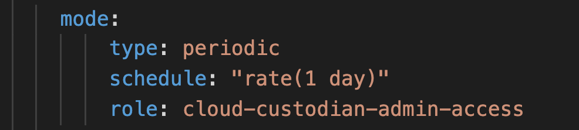
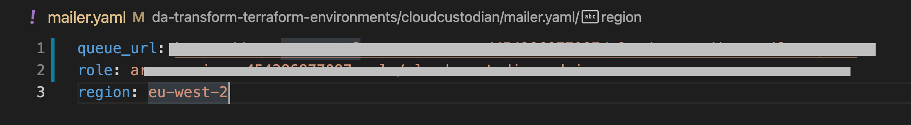
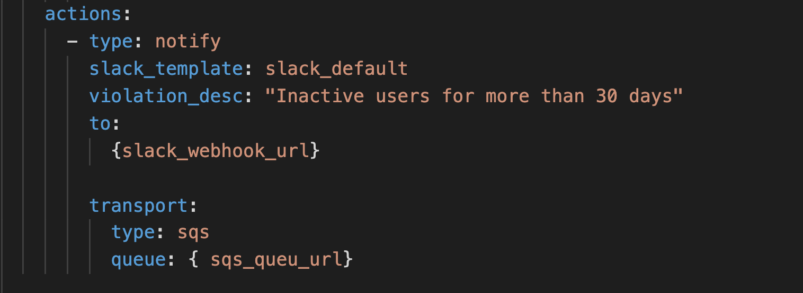

# tna-custodian

## ALERTS AND REMEDIATIONS
* This implementation of Cloud Custodian includes the following alerts and automated remediations:

| AWS SERVICE | RULE NAME                     | CONDITION                                                   | REMEDIATION                 |
| ----------- | ----------------------------- | ----------------------------------------------------------- | --------------------------- | 
| IAM         | Access-key-warn               | Access keys older than 80 days                              | None                        |
| IAM         | Access-key-disable            | Access keys older than 85 days                              | Disable keys                |
| IAM         | Access-key-delete             | Access keys older than 90 days                              | Delete keys                 |
| IAM         | MFA-warn                      | Console user without MFA                                    | None                        |
| IAM         | Dormant-users                 | Inactive for more than 30 days                              | None
| S3          | Mark-unencrypted              | S3 bucket not encrypted                                     | Mark for deletion in 3 days | 
| S3          | Unmark-encrypted              | Previously marked S3 bucket now encrypted                   | Remove mark                 | 
| S3          | Delete-marked-unencrypted     | Marked S3 bucket date condition met                         | Terminate instance          | 
| S3          | Remove-public-acls            | Public ACLs at S3 bucket level                              | Remove public ACLs          | 
| S3          | Mark-public-policy            | S3 bucket with public policy                                | Mark for deletion in 3 days | 
| S3          | Unmark-public-policy          | Previously marked S3 bucket no longer public                | Remove mark                 | 
| S3          | Delete-marked-public-policy   | Marked S3 bucket date condition met                         | Terminate instance          | 
| S3          | Check-for-public-access-block | S3 bucket without public access block                       | Set public access block     |
| ECR         | Ecr-scan-on-push              | Image Scanning on push not enabled                          | Set Scanning on push

## USAGE

### Prerequisites
* AWS CLI

### Install Cloud Custodian
* Use python3 virtual environment:
```
python3 -m venv custodian
. custodian/bin/activate
```
* Install Cloud Custodian
```
(custodian) pip install c7n
```

### Install Custodian Tools/Dependencies
* Ensure you are still within the Python virtual environment
```
(custodian) pip install c7n-mailer
``` 

### Adding policies 
Tna-custodian policies can be found in this * [TNA Cloud Custodian GitHub repository](https://github.com/nationalarchives/tna-custodian/tree/master/custodian/policies)

* Create Roles (`cloud-custodian-admin-access`) in TRE accounts for lambda and add it to the polices under `mode`.


### Setting-up mailer

1. Create (in TRE Manaement account) a SQS Queue and grant cross-account access.
2. Create (in TRE Manaement account) a Role for mailer lambda. 
2. Create mailer.yaml and add the Queue URL and Role ARN. 

3. Add Slack-webhook URL and the SQS Queue URL under `action` in custodian policies. 

4. Run `c7n-mailer --config mailer.yml --update-lambda`
This will create a Lambda (`custodian-mailer`) whcih gets invoked by a EventBridge Rule (`custodian-mailer`).
By default the Lambda runs every 5 minutes but it can be chaged in AWS EventBridge. 


### Deploying policies

1. Set up AWS profiles by running `aws configure`. 
1. Run `custodian run --metrics aws --log-group=/cloud-custodian/*/eu-west-2 --profile=AWS_PROFILE -s output policies.yaml`


### LINKS
* [Cloud Custodian documentation](https://cloudcustodian.io)
* [Cloud Custodian GitHub repository](https://github.com/cloud-custodian)
