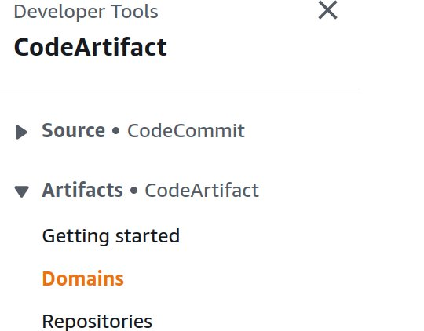
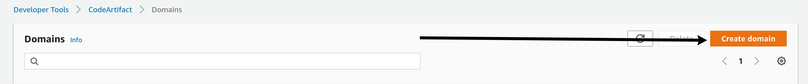
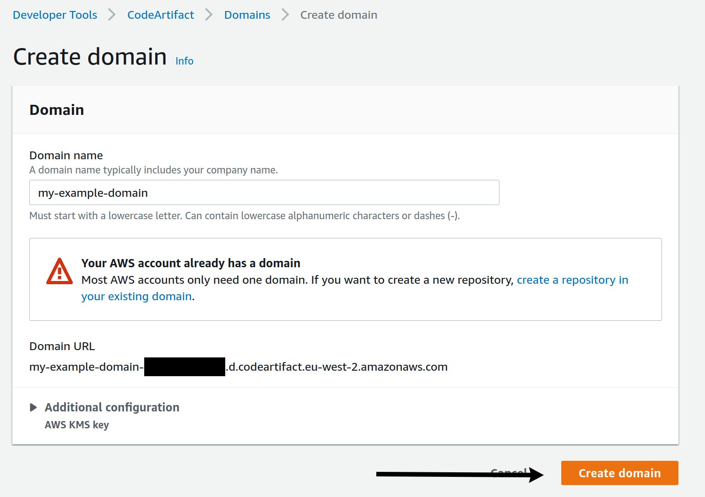
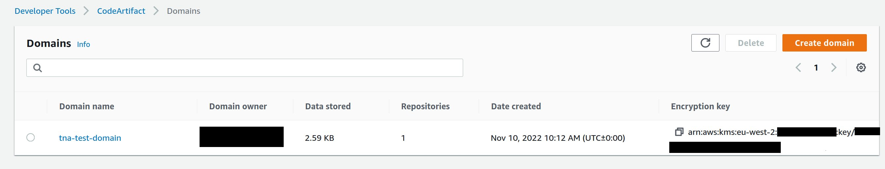
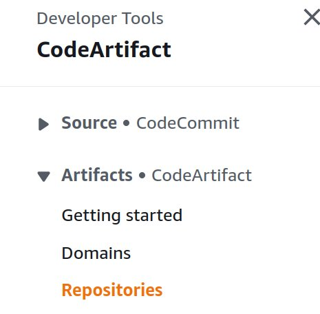
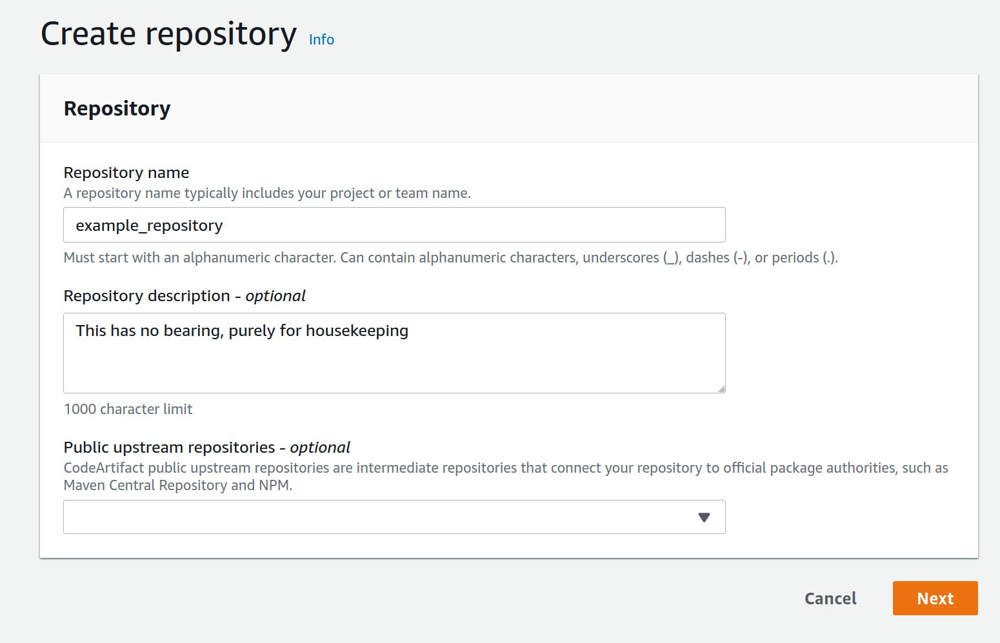
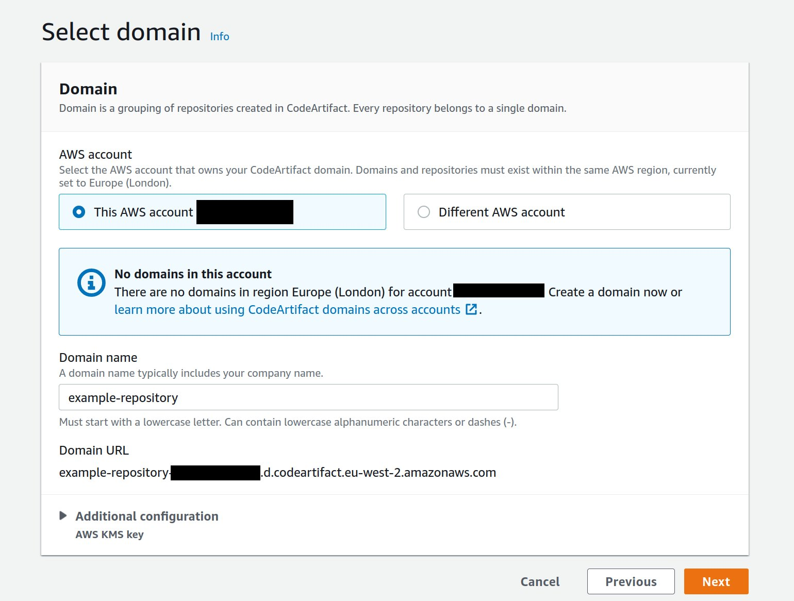
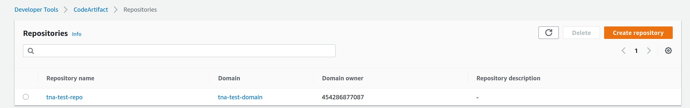
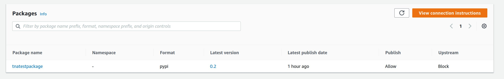
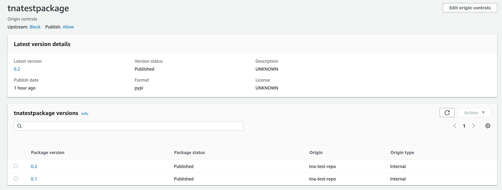

# Uploading software Packages to AWS CodeArtifact

The first step will typically only need to be done once. This guide includes instructions as to how to

1. Initialising the domain
2. Creating a repository.
3. Uploading a python package to the repository
4. Using a Python package in a project

### 1. Initialising the domain

This can be either done via the console or by CLI. To create via
the CLI enter the following command

**Note :** This should be done while signed in to the account you intend to host your domain & repository

```
 aws codeartifact create-domain --domain my-domain
```

To do this via the web console - navigate to the "Domains" header under CodeArtifact.



Click the "Create Domain" button



This should bring up the following screen, type your domain name and - click create domain.



Under either method if everything has been done correctly the domain should now be visible alongside it's key.



### 2. Creating a repository.

To do this via the CLI use the following command under the appropriate domain

```
$ aws codeartifact create-repository --domain DOMAIN_NAME --domain-owner $AWS_ACCOUNT_ID --repository REPOSITORY_TO_CREATE
```

To do this via the console select the repositories link on the left



Click the "Create Repository button" and fill in the following screen



**Note :** If the intention is to make these packages public you can select a package service at this stage.

The next screen will give you the option to create the repository under a domain with the current account or under
a different domain under a different account (these accounts need to be linked)



The next screen will summate the configuration for the repository, if these are correct you can create the repository
which will be visible like so.



### 3. Uploading a python package to the repository

This is achieved via a github actions workflow - an example of which is below.

Sections surrounded by square brackets will need to be replaced with project specific
configurations. These can be stored as secrets within the repository.

This can be triggered via an automated workflow or manually.

**Note :** The following workflow makes the assumption that a setup.py file is
located at the root level of your project, an example of this can be found below.

```yaml
name: Python application
on:
  push:
    branches:
      - [BRANCHNAME / CONFIGURATION]
jobs:
  deploy-lambda:
    runs-on: ubuntu-latest
    permissions:
      packages: write
      contents: read
      id-token: write
    steps:
      - uses: actions/checkout@v2
      - uses: actions/setup-python@v2
        with:
          python-version: '3.8'
      - name: Install dependencies
        run: |
          python -m pip install --upgrade pip
          pip install setuptools wheel twine
      - uses: aws-actions/setup-sam@v1
      - uses: aws-actions/configure-aws-credentials@v1
        with:
          role-to-assume: arn:aws:iam::[12 DIGIT ARN NUMBER]:role/[ROLENAME]
          aws-region: eu-west-2
          role-session-name: InternalGitHubActionsRoleName
      - name: Build and publish
        run: |
          export TWINE_USERNAME=aws
          export TWINE_PASSWORD=`aws codeartifact get-authorization-token --domain tna-test-domain --domain-owner [ARN ACCOUNT NUMBER] --region eu-west-2 --query authorizationToken --output text`
          export TWINE_REPOSITORY_URL=`aws codeartifact get-repository-endpoint --domain tna-test-domain --domain-owner [ARN ACCOUNT NUMBER] --repository tna-test-repo --region eu-west-2 --format pypi --query repositoryEndpoint --output text`
          python setup.py sdist bdist_wheel --verbose
          twine upload dist/*

```
This workflow initiates the following python script

The name field determines the name of the package name. This is what will be specified in
a "requirements.txt" file

**Note :** Package names will always be in-kebab-case any attemp

Multiple python classes can be added from multiple python packages, which can be specified under the
packages parameter - they will however require their own respective init.py files.

```python
from setuptools import setup

setup(
    name=[NAME OF PACKAGE],
    version='0.1',
    packages=[DIRECTORIES TO BE ADDED],
    include_package_data=True,
    zip_safe=False
)
```
**Note :** The version parameter will need to be updated before deployments or the deployment will fail.

A successful deployment should be viewable through the console in its respective repository



previous versions of the package can be viewed from clicking the package name



### 4. Using a Python package in a project

In order to use the python package a GitHub workflow will need two of the following three code snippets.
The first step is manditory, and consists of altering the package manager to use Codeartifact as it's
upstream source.

**NOTE :** All parameters in square brackets will need to be replaced.

```yaml
aws codeartifact login --tool pip --repository [REPOSITORY] --domain [DOMAIN] --domain-owner [DOMAIN ARN NUMBER] --region eu-west-2
```

alternatively

```yaml
export CODEARTIFACT_AUTH_TOKEN=`aws codeartifact get-authorization-token --domain [DOMAIN] --domain-owner [DOMAIN ARN NUMBER] --region eu-west-2 --query authorizationToken --output text`

pip config set global.index-url https://aws:$CODEARTIFACT_AUTH_TOKEN@[DOMAIN]-[ARN NUMBER].d.codeartifact.eu-west-2.amazonaws.com/pypi/[REPOSITORY]/simple/
```

This should allow you to add a parameter in your relative workflow to either pip install the package as you would any other
or use a aws specific requirements.txt file

```yaml
...
    steps:
    - uses: actions/checkout@v2
    - name: Set up Python 3.8
      uses: actions/setup-python@v2
      with:
        python-version: 3.8
    - name: Install dependencies
      run: |
        python -m pip install --upgrade pip
        aws codeartifact login --tool pip --repository [REPOSITORY] --domain [DOMAIN] --domain-owner [DOMAIN ARN NUMBER] --region eu-west-2
        pip install [package name]
        if [ -f requirements_aws.txt ]; then pip install -r requirements_aws.txt; fi
    - name: AWS Published Packages
...

```
