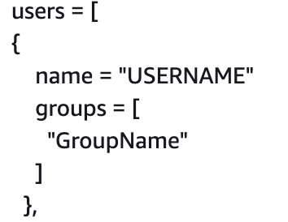

# How to create users for TRE AWS Accounts

## Creating users in AWS Console

> **Warning**
>
> Users should only ever be created by running the _terraform-common_ pipeline.

- Add new user details in **codepipeline.tfvars** in  **TRE Management** account. 
- User should be added to the correct group(s). Group permission details can be found in [**da-transform-terraform-environments**](https://github.com/nationalarchives/da-transform-terraform-environments/tree/common/common/templates) 



- Run **terraform-common** pipeline in **TRE Management** account. Check the plan to make sure no unexpected changes are being made.

## Creating login profiles using AWS CLI 

> **Warning**
> 
> Only users with `iam:CreateLoginProfile` permission can create a login profile.

-  Run  
```bash
aws iam create-login-profile \
--user-name <value> \
--password <value> \
--password-reset-required
```

- This will create a loging profile in **TRE User** account for the user with a password which they have to reset on first sign-in. 
- Users then can assume role(s) that is associated with their respective group(s) in other TRE accounts. 
- Instructions on how to assume roles can be found in [How to assume roles using the AWS CLI](../how-to-assume-roles-using-AWS-CLI/README.md)
