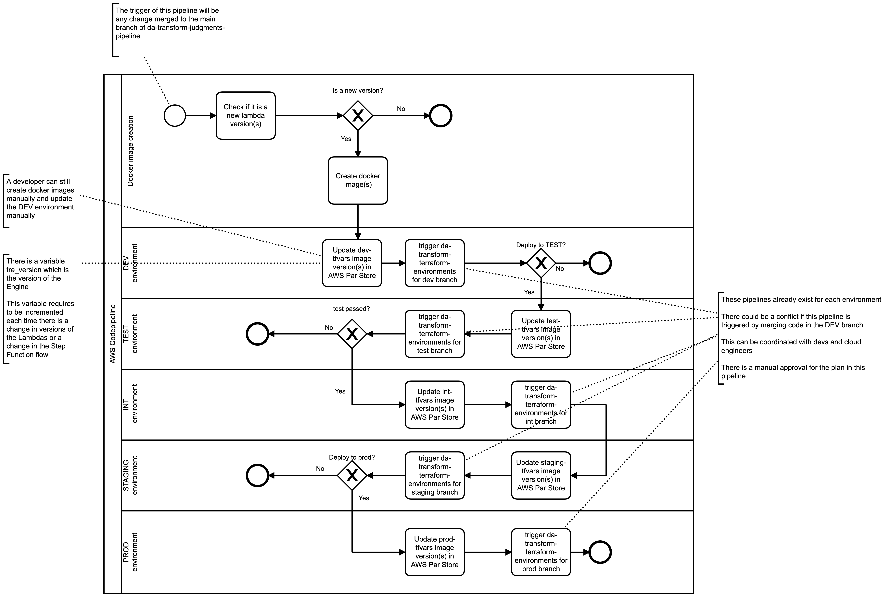

# Release cycle

Releases are almost always a mixture between human and automated processes. The release cycle can be reduced through automation, especially automation of the testing and deployment processes.

## Table of Contents
- [Releasing infrastructure changes](#releasing-infrastructure-changes)
- [Releasing new versions of the Parser](#releasing-new-versions-of-the-parser)
- [Releasing new versions of docker images](#releasing-new-versions-of-docker-images)

## Releasing infrastructure changes

Infrastructure resources are provisioned and maintained using [Terraform](https://www.terraform.io/intro); there are two GitHub repositories used for the Infrastructure-as-Code (IaC) implementation:

- Environments repository: https://github.com/nationalarchives/da-transform-terraform-environments 
    - This repository contains the configuration for setting up the infrastructure using modules contained in the modules repository.
    - The repository has got branches to mirror the different environments required (DEV, TEST, INT, STAGING and PROD)
- Modules repository: https://github.com/nationalarchives/da-transform-terraform-modules
    - This repository contains the reusable modules, across environments that are used to provision the resources which are referenced by the environments Terraform repository.
    - The repository has got branches to mirror the different environments required (DEV, TEST, INT, STAGING and PROD)

Automation is guaranteed by using a [pipeline for each environment](../dev-deploy-guide/README.md#code-pipelines) in the AWS management account (for the TRE AWS accounts see this [link](../../beta-mvp-architecture/README.md#aws-accounts-management)), which deploys the infrastructure changes to the different environments.

The release cycle for infrastructure changes consists of the steps described in the section [Application Update Process](./../dev-deploy-guide/README.md#application-update-process)

> **Note**
> 
> Some changes require to destroy the existing cloud resources and create them with the new settings/configurations, other changes are just modification to the current infrastructure and do not require to destroy cloud resources.
>
> In bth cases, terraform and the pipelines are responsible to apply the changes to the infrastructure, and the flow implemented in the pipeline includes a manual approval to decide whether approve or reject the promote the changes to production.

## Releasing new versions of the Parser

The text parser is a tool being actively developed by a third party that extracts data properties from the text of court judgment documents. It utilises Microsoft’s Office Open XML SDK (Software Development Kit) and is written with the .NET technology stack. For additional information see this [page](../../parser-integration/README.md).

When releasing a new version of the parser, the release cycle consists of the following steps:

1. a new tag was created in the [Parser GitHub repository](https://github.com/nationalarchives/tna-judgments-parser/tags)
2. the creation of a new tag triggers the `parser-pipeline` in the TRE AWS management accounts
3. the pipeline sends a slack message to inform about the new version available for the parser
4. the pipeline creates the new version of the docker image for the parser
5. the pipeline runs the unit tests by executing a Lambda function with the new docker image
6. if the unit tests did not pass, the pipeline stops and a slack message is sent with the error status
7. if the unit tests passed, the pipeline deploys the new version of the parser to DEV, TEST, INT, STAGING and PROD environments
8. the pipeline sends a slack message to inform about the status of the deployment and if any error occurred

## Releasing new versions of docker images

AWS Step Functions service is used to implement multiple workflows to process data and ingest it from and to external services.
A Step Function consists of a sequence of tasks and gateways, tasks are implemented using Lambda funtions packaged as docker images.

When releasing a new version of a docker image for a Lambda function, the release cycle consists of the following steps:

1. a developer raises a new pull request to merge the changes to the `main` branch of GitHub repository [da-transform-judgments-pipeline](https://github.com/nationalarchives/da-transform-judgments-pipeline)
2. when the pull request is approved and merged, it triggers a pipeline in the AWS Management accounts
3. the pipeline checks if there is a new version for the Lambda functions, if yes the pipeline creates the new docker image, if not the pipeline stops
4. after the creation of the new docker image, the pipeline updates the DEV environment and waits for a manual step to approve the deployment to the TEST environment
5. if the deployment was rejected. the pipeline stops
6. if the deployment was approved, the pipeline updates the TEST environment and runs the unit tests
7. if the unit tests did not pass in the TEST environment, the pipeline stops
8. if the unit tests passed in the TEST environment, the pipeline updates the INT and STAGING environments and waits for a manual step to approve the deployment to the PROD environment
9. at this point a user can still reject the changes, which results in the pipeline stopped and PROD environment unchanged
10. if the deployment was approved, the pipeline updates the PROD environment and completes its cycle
