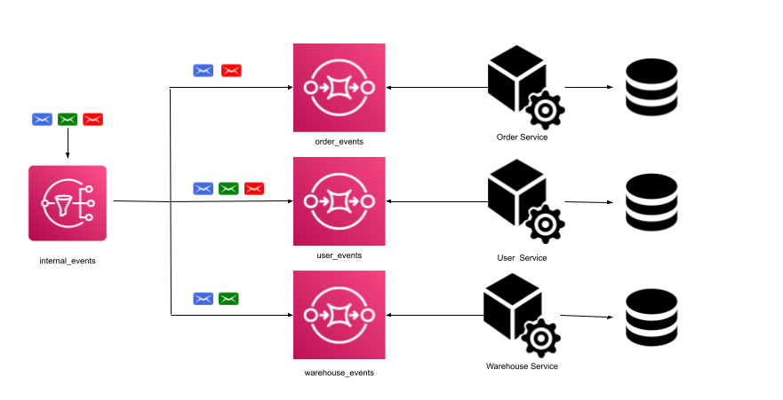
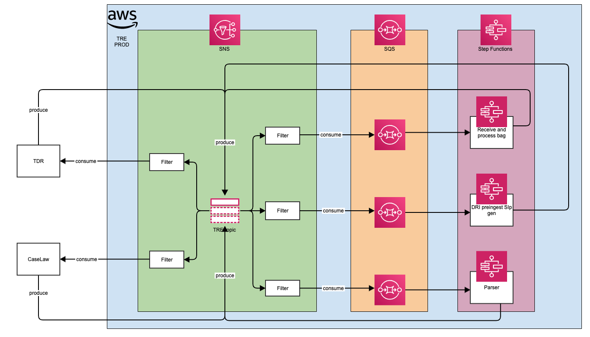
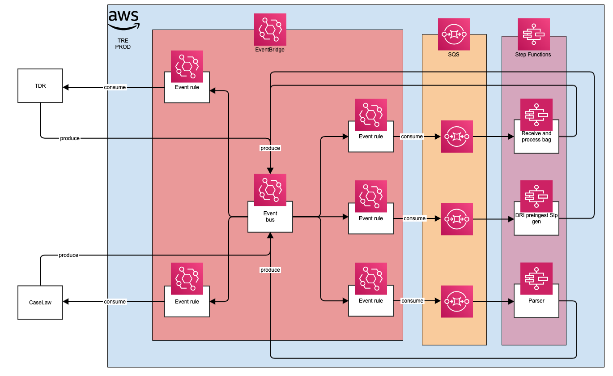

# New messaging architecture

## Table of Contents
- [AWS fan-out pattern](#aws-fan-out-pattern)
    - [SNS](#sns)
    - [SQS](#sqs)
    - [SNS-SQS fan-out](#sns-sqs-fan-out)
- [Event-Driven Architecture](#event-driven-architecture)
    - [AWS EventBridge](#aws-eventbridge)
- [Option-1 - Single SNS topic and multiple SQS queue with fan-out](#option-1---single-sns-topic-and-multiple-sqs-queue-with-fan-out)
    - [SNS Subscription Filter Policies](#sns-subscription-filter-policies)
- [Option-2 - Single SNS topic with AWS EventBridge](#option-2---aws-eventbridge)
    - [SNS vs EventBridge](#sns-vs-eventbridge)
- [Option-3 - Hybrid solution](#option-3---multiple-sns-topics-and-sqs-queues-with-fan-out)
- [Recommendations](#recommendations)
- [References](#references)

## AWS fan-out pattern

### SNS
AWS SNS is a publisher-subscriber network, where subscribers can subscribe to topics and will receive messages whenever a publisher publishes a message on that topic.

### SQS
AWS SQS is a queue service, which stores messages in a queue. SQS cannot deliver any messages, an external service needs to poll SQS and grab the messages from the queue.

By coupling SNS with SQS, you can receive messages at your pace. It allows clients to be offline, and tolerant of network and host failures. You also achieve guaranteed delivery and you can have multiple consumers processing the same message.
A dead-letter queue is a queue that one or more source queues can use for messages that are not consumed successfully. For more information, see Amazon SQS dead-letter queues.

### SNS-SQS fan-out

The fan-out is a messaging pattern that implies the delivery of a message to one or multiple consumers in parallel.

By using this pattern, you can build applications that take advantage of parallel, asynchronous processing. This is extremely useful if your downstream services can work independently.

In AWS, we can use it to replicate an event to one or more SQS queues using SNS. A new feature is that you can now use FIFO topics, in combination with FIFO queues to build applications that require messages to be sent and processed in a strict sequence and without duplicates.

## Event-Driven Architecture

An event-driven architecture uses events to trigger and communicate between decoupled services and is common in modern applications built with microservices.
An event is a change in state that tells you information about something that happened in your application. In event-driven architecture, each component of the application raises an event whenever anything changes. Other components listen and decide what to do with it and how they would like to react.

Event-driven architectures have three key components:
- event producers,
- event routers,
- event consumers.
A producer publishes an event to the router, which filters and pushes the events to consumers. Producer services and consumer services are decoupled, which allows them to be scaled, updated, and deployed independently.

### AWS EventBridge

EventBridge simplifies the process of building event-driven architectures.
EventBridge connects applications using events. An event is a signal that a system’s state has changed, such as a change in the status of a customer support ticket. Customers can integrate their own AWS applications with microservices, SaaS applications, and custom applications as event sources that publish events to an event bus. You can define a filtering rule to filter events and route events to AWS service targets and API destinations (via HTTP endpoints). EventBridge schema registry stores schema generated by your organization’s applications, AWS services, or SaaS applications. A schema includes information such as the title, format and validation rules for event data. You can download code bindings for any schema in the registry in your IDE and directly use the strongly-typed object representing the event in your code.

## Option-1 - Single SNS topic and multiple SQS queue with fan-out

### SNS Subscription Filter Policies

By default, an Amazon SNS topic subscriber receives every message published to the topic. To receive a subset of the messages, a subscriber must assign a filter policy to the topic subscription. A filter policy is a simple JSON object containing attributes that define which messages the subscriber receives.

When you publish a message to a topic, Amazon SNS compares the message attributes to the attributes in the filter policy for each of the topic's subscriptions. If any of the attributes match, Amazon SNS sends the message to the subscriber. Otherwise, Amazon SNS skips the subscriber without sending the message.

## Option-2 - AWS EventBridge

### SNS vs EventBridge

#### More number of targets

SNS is a well-known event-sourcing service. It really shines when the throughput is very high, up into the millions of TPS. EventBridge, meanwhile, supports [400 requests per second only](https://docs.aws.amazon.com/eventbridge/latest/userguide/eb-quota.html).

However, the number of targets supported by SNS is limited compared to EventBridge.

For example, if an event needs to trigger Step Functions, it cannot do it directly as it is not available as a target. It needs to call a Lambda function, and that can trigger the Step Functions. On the other hand, EventBridge supports 17 targets as of now. But, each Rule in EventBridge can configure a maximum of 5 targets.

#### Contet-based filtering
SNS scales practically infinitely, but filtering is limited to attributes, not event content.

Being able to do content-based filtering means it’s possible to have a single event bus for all publishers. Whereas with SNS you often have to have multiple topics to ensure subscribers only receive the events they need. Having a single, centralized event bus is much simpler to manage, especially when you have the ability to register and discover event schemas (see below).

#### Schema discovery

A common challenge with event-driven architecture is identifying and versioning event schemas. EventBridge deals with this challenge with its Schema Registry.

- It provides the schema for all AWS events out-of-the-box.
- You can also enable schema discovery on both the default event bus as well as any custom event buses you have created.
- Once enabled, EventBridge would sample ingested events and auto-generate the schema definitions.
- From here, you can generate language bindings (for Java, Python and TypeScript) and [browse these schemas in VS Code using the AWS Toolkit.](https://docs.aws.amazon.com/toolkit-for-vscode/latest/userguide/eventbridge-schemas.html)

#### Input transformation

Another powerful feature of EventBridge is that it allows you to [transform the event](https://docs.aws.amazon.com/eventbridge/latest/userguide/eb-input-transformer-tutorial.html) before passing it as input to the target(s).

This too, helps remove custom glue code that only serves the purpose of transforming the payload.

#### Summary

1. EventBridge supports a lot more targets, meaning you can integrate between a wider variety of services
2. EventBridges cross-account delivery capability further amplifies its reach. It’s easy to distribute events to Kinesis, Step Functions, and many other services running in another AWS account
3. EventBridge supports native AWS events as well as third-party partner events.
4. EventBridge supports content-based filtering.
5. EventBridge supports input transformation.
6. EventBridge has built-in schema discovery capabilities.

## Option-3 - Hybrid solution

## Recommendations

The [1,200 requests per second only](https://docs.aws.amazon.com/eventbridge/latest/userguide/eb-quota.html) is a limit for TRE in the London region eu-west-2, as well as the route rules to implement in the event bus for delivering a message to a specific consumer.

TNA wants to build an Event-driven architecture where consumers receive all the messages and the logic for filtering the messages is part of the consumer implementation; with this approach there is not any dependency between the event bus and the consumers. The event bus can be implemented using SNS topcis and all the consumers subscribed to a topic will receive the messages sent by the producers.

The recommendation is to adopt option-3.

## References

- https://aws.amazon.com/event-driven-architecture/
- https://aws.amazon.com/eventbridge/
- https://docs.aws.amazon.com/eventbridge/latest/userguide/eb-quota.html
- https://medium.com/aws-in-plain-english/event-driven-architecture-implement-the-fan-out-messaging-pattern-in-aws-using-terraform-f58234d9e208
- https://aws.amazon.com/blogs/compute/building-an-event-driven-application-with-amazon-eventbridge/
- https://docs.aws.amazon.com/sns/latest/dg/sns-message-attributes.html
- https://lumigo.io/blog/5-reasons-why-you-should-use-eventbridge-instead-of-sns/
